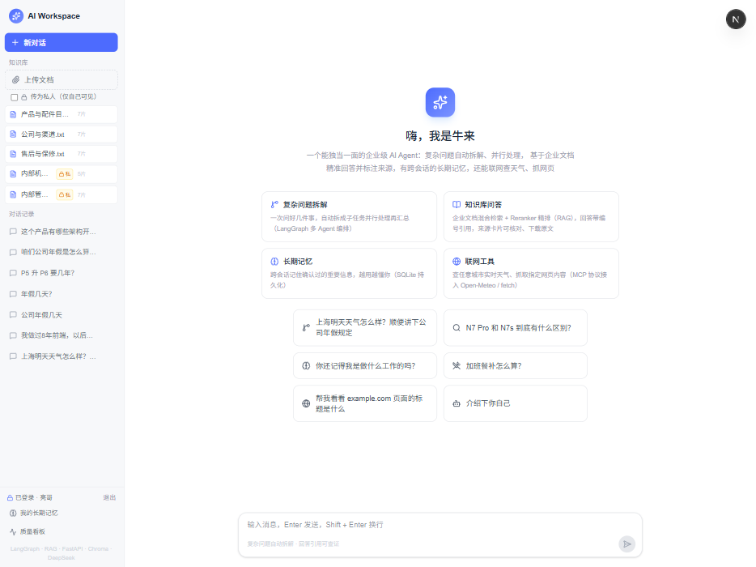
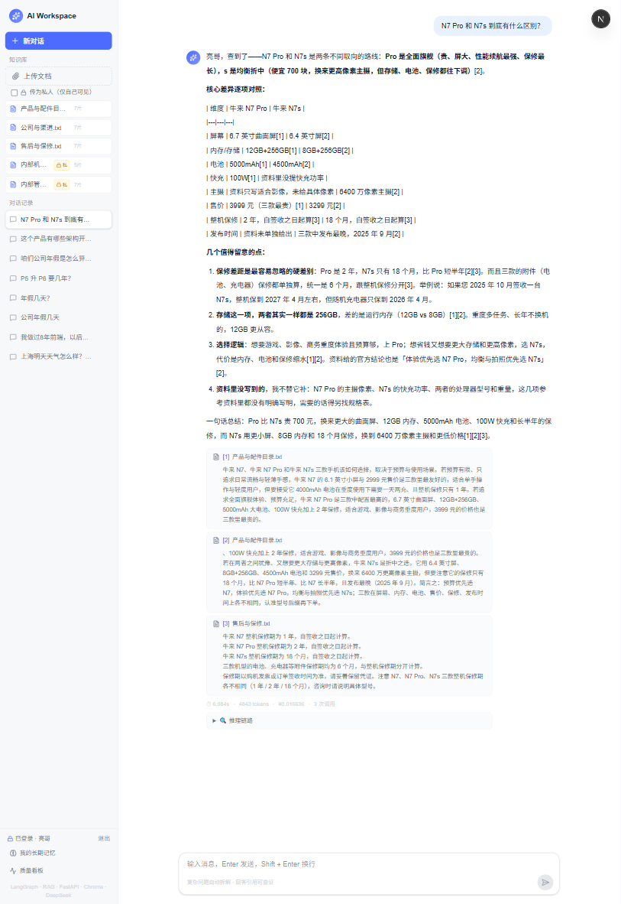
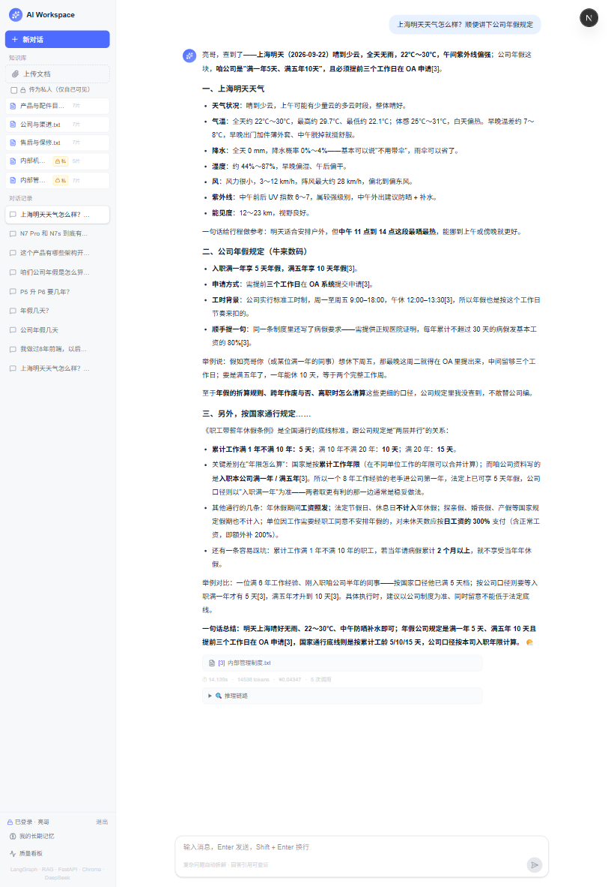
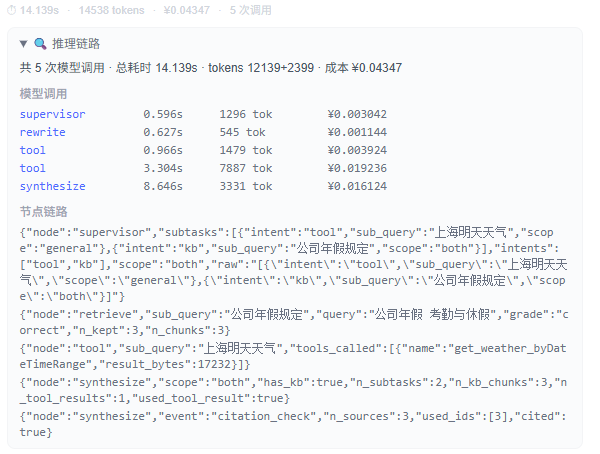
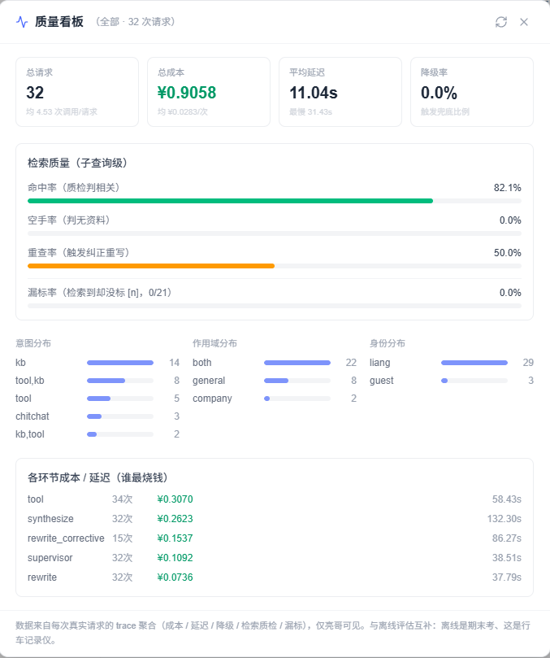

# 牛来 · 企业级 AI Agent

一个能独当一面的企业级 AI Agent：LangGraph 多 Agent 编排（1 Supervisor + 3 Workers），把复杂问题拆成子任务并行处理；混合检索 + Reranker 精排的企业知识库问答，回答带编号引用可溯源；有跨会话长期记忆，能联网调工具，全程可观测、可离线评估。已部署上线。

**🔗 在线演示**：<https://www.modelscope.cn/studios/zl153696752/niulai>

> ModelScope 创空间免费档，**无需登录**即可访问。容器重启后知识库只保留种子文档，详见文末「已知限制」。



---

## 它能做什么

| 能力 | 说明 |
| --- | --- |
| 多 Agent 编排 | LangGraph 手写 StateGraph：Supervisor 把复合问题拆成子任务，`Send` 动态并行派发 retrieve / tool Worker，fan-in 后由 synthesize 汇总 |
| 知识库问答 | 上传 `.txt` / `.md` / `.pdf`，结构化切片入库；混合检索（向量 + BM25 + RRF 融合）+ bge-reranker 精排 + Self-CRAG 质检重查 |
| 引用溯源 | 回答里标 `[1][2]`，点开看命中的原文切片、下载原文件；synthesize 只把真正引用的切片发成卡片 |
| 长期记忆 | 跨会话记住确认过的重要信息（SQLite 持久化），带记忆治理入口（看系统记了啥、一键删错记）|
| 身份与隔离 | JWT 鉴权，游客 / 亮哥双身份；私人文档按身份过滤，游客检索不到也看不到 |
| 联网工具 | 通过 MCP 接入网页抓取（fetch）与天气查询（Open-Meteo）；还自制了一个知识库 MCP 服务端对外开放 |
| 技能包 | `backend/skills/` 下的 Markdown 操作手册，模型按需调用 `load_skill` 取正文（渐进式披露）|
| 可观测性 | 每次回答的成本 / token / 延迟 / 节点级推理链路；亮哥专属质量看板聚合漏标率、降级率等 |
| 离线评估 | 评估集自动生成 + 检索层（Recall@k / MRR / NDCG）+ 生成层（LLM-as-judge 打忠实度 / 相关性）|
| 流式对话 | SSE 逐字输出，打字机效果；先渲染引用卡片再渲染正文 |
| 助手人格 | 固定人设「牛来」，按身份切换语气；检索未命中时如实说不知道，绝不编造 |

## 效果

| 知识库问答 + 引用溯源 | 知识库管理 |
| --- | --- |
|  |  |



## 架构

flowchart TB
    U["浏览器"] -->|"同源 HTTP · 单端口"| F["FastAPI 应用组装 + 静态托管"]
    F -->|"POST /api/chat"| SUP

    subgraph G["LangGraph 多 Agent 编排 · 1 Supervisor + 3 Workers"]
        direction TB
        SUP["Supervisor<br/>拆分子任务 · 判意图 · 定 scope"]
        RET["retrieve Worker ×N<br/>混合检索 + Reranker 精排 + Self-CRAG"]
        TOOL["tool Worker ×M<br/>MCP 工具调用"]
        SYN["synthesize Worker<br/>fan-in 合成 + 编号溯源"]
        SUP -->|"Send 并行派发 · kb 子任务"| RET
        SUP -->|"Send 并行派发 · tool 子任务"| TOOL
        SUP -.->|"全闲聊兜底"| SYN
        RET -->|"固定边 · fan-in"| SYN
        TOOL -->|"固定边 · fan-in"| SYN
    end

    L["DeepSeek API"]
    SUP -.->|"拆分 / 分类"| L
    RET -.->|"改写 / 质检"| L
    SYN -.->|"合成生成"| L
    RET -->|"向量召回"| EMB["bge-small-zh-v1.5 · ONNX int8"]
    RET -->|"精排"| RR["bge-reranker-base · ONNX int8"]
    RET --> C[("Chroma 向量库")]
    TOOL --> M["MCP 服务端 · fetch / weather"]
    SYN -->|"SSE 逐字回流"| F

**一次提问的完整链路**：

1. 前端 `POST /api/chat`，进入 LangGraph 图。**Supervisor** 调 DeepSeek 把问题拆成子任务，每个子任务判意图（kb / tool / chitchat）、定作用域 scope（company / general / both）
2. **`route_subtasks` 条件边**按子任务用 `Send` **动态并行派发**：kb → retrieve Worker、tool → tool Worker（几个子任务派几个实例，`Promise.all` 式并行）
3. 每个 **retrieve Worker**：先做查询改写，再混合检索（向量召回 + BM25 关键词召回 → 身份过滤 → RRF 融合）→ bge-reranker 精排取 top-3 → Self-CRAG 质检（reranker logit 阈值 `-2.0`），不合格则有界重查一次
4. **tool Worker** 按需调 MCP 工具（天气 / 网页抓取）拿回结果
5. **fan-in**：所有 Worker 跑完，产出的切片 / 工具结果经 add reducer 合并回全局 State，**synthesize Worker** 只执行一次——按 scope 分流话术合成回答，用到的切片标 `[n]`，SSE 逐字流回前端
6. 前端先渲染引用卡片、再渲染正文（卡片先出场，避免正文引用了 `[1]` 而卡片还没到）

## 技术栈

| 层 | 选择 | 版本 |
| --- | --- | --- |
| 后端 | FastAPI + Python | Python 3.13 |
| 前端 | Next.js（静态导出）+ React + TypeScript + Tailwind | next 16.3.3 / react 19.2.8 |
| 向量库 | Chroma | 1.5.9 |
| 嵌入模型 | bge-small-zh-v1.5（ONNX int8，512 维） | 随仓库打包 22.9 MB |
| 大模型 | DeepSeek（OpenAI 兼容格式） | API |
| Agent 编排 | LangGraph（主力）/ LangChain / 手写版 | langgraph 1.2.11 |
| 工具协议 | MCP（fetch + 天气） | mcp 1.29.1 |
| 部署 | ModelScope 创空间 · Docker 单容器 | `python:3.13-slim` |
| 包管理 | 后端 pip，前端 pnpm | pnpm 12 |

## 四个我踩过坑才想明白的技术取舍

### 1. 把 Chroma 默认的英文嵌入模型换成中文的

Chroma 自带 `all-MiniLM-L6-v2`，词表是 30522 个**英文** wordpiece。实测它对 300 字中文切片的 `[UNK]` 率高达 **66%**——「门禁码」三个字全部变成 `[UNK]`，问题「3 号会议室门禁码是多少」进模型后只剩 `3` 和 `会` 两个有效 token。

**故障表现极具迷惑性**：文档上传成功、切片数正常、日志一行报错都没有，但问什么都答「知识库里没有收录」。

换成 `bge-small-zh-v1.5`（中文 BERT 词表 21128 字，ONNX int8 量化 22.9 MB，512 维）后 `[UNK]` 归零，同一问题命中 rank1。三个实现细节：

- **模型随仓库打包**，不在构建期联网下载。原方案要在 Dockerfile 里 `RUN` 预热 166 MB 模型，构建机一旦拿不到就静默失败
- **自定义 `EmbeddingFunction` 必须加 `@register_embedding_function`**。容器 CMD 是 `python seed.py && uvicorn`，两个独立进程先后打开同一个 collection；未注册时第一个进程正常，第二个进程要到 `query()` 才抛 `ValueError`，报错点离根因很远
- **换模型必须删库重建**。旧向量 384 维、新的 512 维，Chroma 会拦住并报 `Embedding function conflict`；而且这是**双向锁**，回滚也要删库

附带收益：BGE 不做定长 padding，单次编码约 0.001 s，比 Chroma 写死 `padding length=256` 的 MiniLM 快约 90 倍；镜像小了 63 MB。

### 2. 双阈值检索：距离闸门 + 模型自判

`rag.py` 里 `dist < 1.1` 是第二道防线，第一道是模型自己决定「这问题该不该查库」。

1.1 这个数是实测标定的：命中的答案切片落在 **0.59~0.88**，同文档里不相关的小节落在 **1.03~1.39**，1.1 正好卡在两堆中间。往上调会漏答，往下调会放进无关切片污染提示词。

⚠️ 一个容易踩的坑：Chroma 建 collection 时不传 metadata，默认用的是 **l2（平方欧氏）空间**而不是 cosine。对单位向量而言 `l2² = 2 × cosine 距离`，所以换嵌入模型后这个阈值必须重新标定，不能沿用旧数。

### 3. 检索由代码先做，不交给 Agent 自主决定

LangGraph 版的图只负责「基于资料可靠地生成回答」，检索是代码在进图之前做完的。

让 Agent 自己决定要不要查库看起来更「智能」，但有两个实际代价：引用卡片会晚于正文出现（时序错乱），以及未命中时的「自然回应」不可控。取舍原则是**确定性的活给代码，生成性的活给模型**，顺带还省一次决策调用。

### 4. 单容器同源部署

Next.js 静态导出（`output: "export"`）后由 FastAPI `StaticFiles` 托管，一个进程一个端口。免 CORS、免 nginx、免第二个容器。

前端 API 基地址在生产环境是**空串**（走相对路径），开发环境才是 `http://localhost:8000`。`process.env.NODE_ENV` 由 Next.js 在**构建时**替换成字符串字面量，打进产物的代码里不存在 `process` 这个变量，所以浏览器里不会报错。

> 仓库里同时保留了三代 Agent 实现（手写版 / LangChain / LangGraph），靠 `USE_LANGCHAIN`、`USE_LANGGRAPH` 两个开关切换，目的是对照学习「框架到底替我做了什么」。**生产项目只会保留一套**，这里共存是刻意的学习设计。

## 可观测性：推理链路 + 质量看板

企业级 Agent 不能是黑盒。牛来把"每次回答背后发生了什么"完全摊开，分**单次**和**全局**两个视角（均仅亮哥可见）：

**① 推理链路（单次请求级）**——每条回答下方挂一个可展开的「🔍 推理链路」抽屉，摊开这次问答的完整执行轨迹：共几次模型调用、总耗时、prompt/completion tokens、成本，以及**节点级 trace**（Supervisor 拆了哪些子任务、每个 retrieve 的检索质检 grade、有没有触发降级/重查）。哪一步慢、哪一步烧钱、哪一步降级，一眼定位。



**② 质量看板（全局聚合级）**——侧边栏「质量看板」打开一个模态，把所有真实请求的 trace 聚合成健康度指标：核心数字（总请求 / 总成本 / 平均延迟 / 降级率）、检索质量（命中率 / 空手率 / 重查率 / 漏标率）、意图·作用域·身份三类分布、各环节成本排序。



数据全部来自每次请求写进 SQLite `traces` 表的运行时信号，`metrics.py` 只读聚合、不额外采集。它跟**离线评估**互补——离线是"期末考试"（固定题库、有标准答案），质量看板是"行车记录仪"（真实请求、无标准答案，靠运行时信号看健康度）。

## 本地跑起来

**前置**：Python 3.13、Node.js 20 以上、pnpm。

```powershell
# 1) 后端
cd backend
python -m venv venv
.\venv\Scripts\Activate.ps1
pip install -r requirements.txt

# 2) 新建 backend/.env，写入一行：
#    DEEPSEEK_API_KEY=你的密钥

# 3) 灌种子文档（可选，不灌则知识库是空的）
python seed.py

# 4) 起后端
python -m uvicorn app.main:app --reload --port 8000
```

```powershell
# 5) 前端（另开一个终端）
cd frontend
pnpm install
pnpm dev
# → http://localhost:3000
```

⚠️ 本地是**前后端分离**跑，页面在 3000、API 在 8000；线上是单端口 7860 既出页面又出 API（因为静态产物被拷进了镜像）。所以本地开 `http://localhost:8000` 看不到页面是正常的，要看接口文档请开 `http://localhost:8000/docs`。

**环境变量**：

| 变量 | 必填 | 默认 | 说明 |
| --- | --- | --- | --- |
| `DEEPSEEK_API_KEY` | ✅ | 无 | 写在 `backend/.env`，已被 gitignore 排除 |
| `DATA_DIR` | | `backend/` | 数据根目录，`uploads/` 和 `chroma_db/` 都在它下面 |
| `CORS_ORIGINS` | | `http://localhost:3000` | 逗号分隔的白名单 |
| `NEXT_PUBLIC_API_BASE` | | 开发 `localhost:8000`，生产空串 | 构建期变量，改了要重新 `pnpm build` |
| `LISTENING_PORT` | | `7860` | 创空间平台注入 |

## 接口

| 方法 | 路径 | 作用 |
| --- | --- | --- |
| `GET` | `/health` | 健康检查 |
| `POST` | `/api/chat` | 对话，SSE 流式返回 |
| `POST` | `/api/upload` | 上传入库（`.txt`/`.md`/`.pdf`，单文件 ≤ 5 MB，提取后 ≤ 30 万字） |
| `GET` | `/api/files` | 知识库文件列表（含切片数） |
| `DELETE` | `/api/files/{filename}` | 删除（禁删名单内的种子文档会被 403 拦住，只能同名覆盖） |
| `GET` | `/api/files/{filename}/download` | 下载原文件 |

启动后开 <http://localhost:8000/docs> 有自动生成的 Swagger UI。

## 目录结构

```
ai-workspace/
├── backend/
│   ├── app/
│   │   ├── graph.py            # 🔴 LangGraph 多 Agent 编排核心：Supervisor + retrieve/tool/synthesize，Send 并行 + fan-in
│   │   ├── llm_gateway.py      # 模型调用统一收口：tenacity 重试/超时/降级 + token/成本/延迟埋点
│   │   ├── rag.py              # 检索：结构化切片、混合检索（向量+BM25+RRF）、Self-CRAG 质检重查
│   │   ├── reranker.py         # bge-reranker-base 精排（ONNX cross-encoder，缺失时降级 RRF）
│   │   ├── embeddings_bge.py   # 自定义中文嵌入函数（bge-small-zh，ONNX Runtime）
│   │   ├── memory.py           # 记忆官：后台从对话抽取长期记忆（步骤11）
│   │   ├── db.py               # SQLite 持久化层（标准库 sqlite3 无 ORM）：traces 可观测表 + 长期记忆 CRUD
│   │   ├── metrics.py          # 在线质量看板：把 traces 运行时数据聚合成统计指标（步骤12B）
│   │   ├── auth.py             # JWT 鉴权 + bcrypt 口令哈希 + 游客/亮哥双身份守卫
│   │   ├── agents.py           # 人格提示词 / 合成提示词 / MCP 加载器 / 技能与工具清单
│   │   ├── config.py           # 配置与资源单例：env、模型客户端、Chroma、USE_MCP 开关
│   │   ├── skills.py           # 技能包加载器（list_skills / load_skill）
│   │   ├── main.py             # FastAPI 应用组装 + 路由 + 静态托管 + 记忆治理端点
│   │   ├── mcp_server.py       # 自制知识库 MCP 服务端（把检索能力开放给外部客户端）
│   │   └── models/             # bge-small-zh-v1.5 嵌入 + bge-reranker-base 精排（ONNX int8）
│   ├── skills/product-guide/SKILL.md   # 技能包正文（Markdown 操作手册）
│   ├── seed.py                 # 种子文档灌入脚本（容器启动时先跑）
│   └── requirements.txt
├── frontend/src/
│   ├── app/page.tsx            # 页面：业务编排
│   ├── components/             # Sidebar / Welcome / MessageList / ChatInput
│   ├── hooks/                  # useConversations / useKnowledgeFiles / useAuth
│   ├── lib/                    # api.ts（基地址切换）/ auth.ts（token 存取）
│   └── types.ts                # 共享类型
├── docs/
│   ├── 项目实施手册.md          # 5000+ 行完整实施记录（含所有踩坑复盘）
│   ├── 企业级改造方案.md         # 架构升级与实施路线图（步骤清单）
│   └── images/                 # README 配图
└── README.md
```

## 已知限制

如实写，不粉饰：

- **容器重启后知识库会清空**。创空间免费档磁盘不保证跨重启持久，每次启动靠 `seed.py` 重建种子文档。**你上传的文档会消失**；长期记忆（SQLite）同样不跨重启持久
- **免费档可能休眠**。休眠策略未实测，长时间无访问后首次打开可能要等容器冷启动
- **Self-CRAG 阈值 `-2.0` 是经验值**。跑 Precision-Recall 曲线标定的，语料分布大变后可能需要重新标定
- **长期记忆目前只对亮哥生效**。游客身份不写记忆（`memory.py` 抽取、`db.py` 存储都按身份隔离），这是刻意的隐私设计，不是没做完
- **Reranker 缺失时降级为纯 RRF**。`bge-reranker-base`（279 MB）走 `_deploy` 同步，若未部署则不精排，功能可用、精度略降
- **嵌入模型用 int8 量化**，相比 fp32 有轻微精度损失（实测相似度区间 0.7421~0.8661 vs fp32 的 0.7483~0.8830），换来体积从 86 MB 降到 23 MB

## 实施手册

[`docs/项目实施手册.md`](docs/项目实施手册.md) 是这个项目从零到上线的完整实施记录，5000+ 行，包含每一步的代码、每次踩坑的复盘：构建机屏蔽清华源导致 pip 拿回空索引、平台自动生成的 `.gitattributes` 把 23 MB 模型变成 133 字节 LFS 指针、Chroma 嵌入函数跨进程注册、cosine 与 l2 空间差 2 倍导致的阈值误判……

**这份手册是学习过程的产物，写得比代码还长。**

## License

Apache License 2.0
